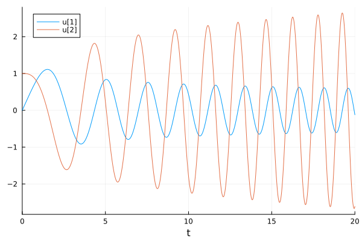
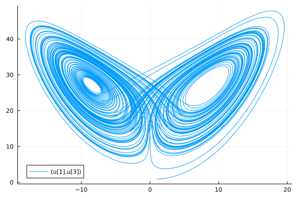

# JitEngine.jl

*JitEngine* is a lightweight just-in-time (JIT) compiler, written in pure Julia, that directly translates Julia Symbolics expressions into machine code.

*JitEngine* has no binary dependency and uses Julia Symbolic ecosystem (SymbolicUtils.jl, Symbolics.jl, and ModelingToolkit.jl) to directly compiles symbolic models (e.g., representaing ordinary differential equations) into machine code. 

*JitEngine* is a companion package of [symjiy](https://](https://github.com/siravan/symjit/) and [SymJit](https://](https://github.com/siravan/SymJit.jl). The main aim of symjiy is to provide JIT capability to Python sympy ecosystem, whereas SymJit.jl does the same to Julia Symbolics. *SymJit* and *symjit* share the same underlying compiler library written in Rust. *JitEngine* is the result of porting the compiler code from the Rust library into Julia.

The JIT compiler generates AVX-compatible code for x86-64/AMD64 processors. Intel introduced the AVX instruction set in 2011; therefore, most currently available processors support it. On ARM64 processors, the backend generates code for aarch64 instruction set. ARM32 and IA32 are not supported, but Risc V is in development.

# Installation

*JitEngine.jl* can be installed as

```julia
using Pkg
Pkg.install("https://github.com/siravan/JitEngine.jl")
```

Its main depenendencies are the Julia Computer Algebra System (CAS) infrastrusture, i.e., *SymbolicUtils* and *Symbolics*, plus the higher-level modeling language *ModelingToolkit* that provides the link to various solvers. It has no seprate binary depdendency.

# Tutorial

The main interface of *JitEngine* are three `compile` functions: `compile_func`, `compile_ode`, and `compile_jac`.

`compile_func` is a general-purpose compilation functions that accepts various forms of input, such as symbolic expressions, ODESystem from ModelingToolkit, and even certain pure Julia functions. On the other hand, `compile_ode`, and `compile_jac` are specialized functions to provide fast compiled functions to pass to DifferentialEquations ODE solvers.

## Using `compile_func`

The primary action of `compile_func` is to compile a list of symbolic expressions. In this form, its signature is `compile_func(states, obs; params=[], kw...)`, where `states` is a list of symbolic expressins, `obs` is a list of symbolic expressions, and the optional `params` is a list of symbolic variables. Other optional arguments will be discussed below. The output of `compile_func` is a callable object, i.e., an object that behaves like a function.

```julia
using JitEngine
using Symbolics

@variables x y
f = compile_func([x, y], [x+y, x*y, x^3])
@assert f(3, 2) == [5.0, 6.0, 27.0]
```

Here, `f` accepts 2 `= length(states)` values as input and returns an array of size 3 `= length(obs)` of doubles.

`compile_func` also does automatic vectorization. Vectorization is activated by passing a 2D array of size `num_of_samples x num_of_states` to `f`:

```julia
X = rand(1000, 2)

@assert f(X)[:, 1] == X[:, 1] .+ X[:, 2]
@assert f(X)[:, 2] == X[:, 1] .* X[:, 2]
@assert f(X)[:, 3] == X[:, 1] .^ 3
```

We can also pass a Julia function to `compile_func`. The Julia function should accept one or more scalar double values and returns a double result. `compile_func` converts the function to an equivalent symbolic form; therefore, the function is restricted to a subset of possible Julia functions. Specially, it can only have constant loops and conditions should be through `IfElse.ifelse`.

```julia
h(x, y, z) = x + y * z
f = compile_func(h)
@assert f(3, 4, 5) == 23.0
```

Note that in this situation `f` accepts separate values as input (instead of an array) and returns a single scalar double value. We can also pass an anonumous function as `f = compile_func((x, y, z) -> x + y * z)`.

`compile_func` also accepts a list of parameters (optional argument `params`). See below for examples.

## Using `compile_ode`

The main utility of *JitEngine* is to prepare compiled functions for SciML functions, especially ODE solvers. These routines expect input of form `f!(du, u, p, t)` and `jac!(J, u, p, t)`, which are generated by `compile_ode` and `compile_jac`, respectively.

`compile_ode` has three main forms. The basic usage has a signature of `compile_ode(t, states, eqs; params, kw...)` and returns a callable with signature of `f(du, u, p, t)`:

```julia
using JitEngine
using Symbolics
using DifferentialEquations
using Plots

@variables x y t
f = compile_ode(t, [x, y], [y, -x * t])
prob = ODEProblem(f, [0.0, 1.0], (0.0, 20.0), [])
sol = solve(prob)
plot(sol)
```

The output are Airy functions, as it should:



We can also define and pass parameters to `compile_ode`. Let's solve Lorenz equation:

```julia
@variables x y z
@variables σ ρ β    # @parameters if ModelingToolkit is used

f = compile_ode(t, [x, y, z], [σ * (y - x), x * (ρ - z) - y, x * y - β * z]; params = [σ, ρ, β])
prob = ODEProblem(f, [1.0, 1.0, 1.0], (0.0, 100.0), (10.0, 28.0, 8 / 3))
sol = solve(prob)
plot(sol)
```

The output is the strange attractor:



Instead of passing symblic expressions, we can pass a Julia function:

```julia
function lorenz(du, u, p, t)
    x, y, z = u
    σ, ρ, β = p

    du[1] = σ * (y - x)
    du[2] = x * (ρ - z) - y
    du[3] = x * y - β * z
end

f = compile_ode(lorenz)
prob = ODEProblem(f, [1.0, 1.0, 1.0], (0.0, 100.0), (10.0, 28.0, 8 / 3))
sol = solve(prob)
plot(sol; idxs=(1, 3))
```

The third way to use `compile_ode` is to pass an `ODESystem` or `System` (ModelingToolkit v10) object:

```julia
using JitEngine
using Symbolics
using ModelingToolkit
using DifferentialEquations
using Plots

@independent_variables t
@variables x(t) y(t) z(t)
@parameters σ ρ β

D = Differential(t)

eqs = [ D(x) ~ σ * (y - x),
    D(y) ~ x * (ρ - z) - y,
    D(z) ~ x * y - β * z]

@mtkcompile sys = System(eqs, t)

f = compile_ode(sys)
prob = ODEProblem(f, [1.0, 1.0, 1.0], (0.0, 100.0), [28.0, 8 / 3, 10.0])
sol = solve(prob)
plot(sol; idxs=(3, 1))
```

## Using `compile_jac`

`compile_jac` is a companion of `compile_ode` to calculate Jacobian to accelerate ODE solvers. It has exactly the same signature as `compile_ode` and returns a callable with signature `jac!(J, u, p, t)`.

```julia
using JitEngine
using Symbolics
using DifferentialEquations
using Plots

function lorenz(du, u, p, t)
    x, y, z = u
    σ, ρ, β = p

    du[1] = σ * (y - x)
    du[2] = x * (ρ - z) - y
    du[3] = x * y - β * z
end

f = compile_ode(lorenz)
jac = compile_jac(lorenz)

ff = ODEFunction(f; jac)

prob = ODEProblem(ff, [1.0, 1.0, 1.0], (0.0, 100.0), (10.0, 28.0, 8 / 3))
sol = solve(prob)
plot(sol; idxs=(1, 3))
```

As mentioned above, when we pass a Julia function to any of the `compile` functions, *JitEngine* reverse-engineers the symbolic equivalent of the function. `compile_jac` does symbolic differentiation using the machinery of Julia Symbolics and then compiles the result.

## Using Symbolic Arrays

As of version 0.2, `compile_func` understands Symbolic arrays. Both `states` and `obs` can be a mix of symbolic scalars and arrays. For example,

```julia
using JitEngine
using Symbolics

@variables X[1:3, 1:3], Y[1:3, 1:3], a

f = compile_func([a, X, Y], [X .^ a * Y])

x = rand(size(X)...)
y = rand(size(Y)...)

@assert(f(2.0, x, y)[1] ≈ (x .^ 2) * y)
```
